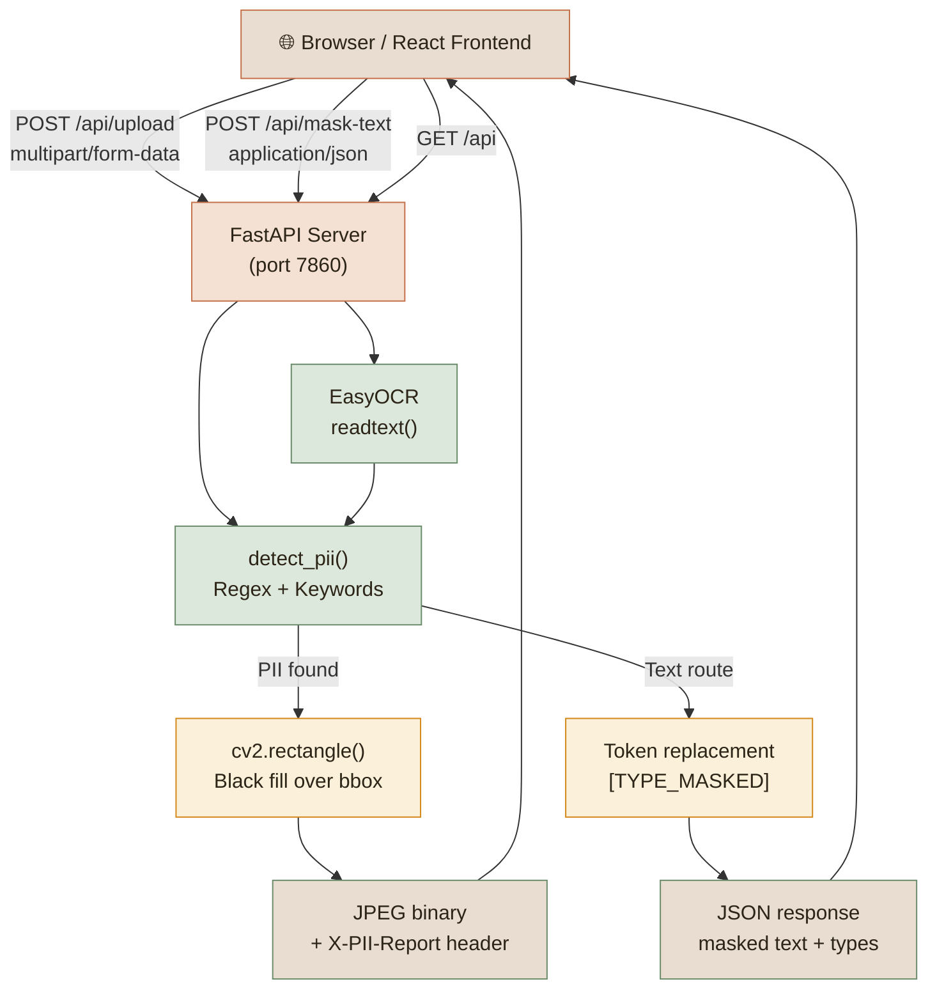

# PII Masking App

Automatically detect and redact **Personally Identifiable Information** from document images and free-form text using OCR and pattern matching — no external AI APIs required.

**Live demo →** [Hugging Face Space](https://huggingface.co/spaces/BugHunterX2101/pii-masking-app)

---

## What it does

| Mode | Input | Output |
|---|---|---|
| **Image** | JPEG / PNG / WebP / BMP document photo | Masked image with PII regions blacked out + detection report |
| **Text** | Any free-form text | Redacted text with `[TYPE_MASKED]` tokens replacing PII |

### Detected PII types

| Type | Pattern / Method | Example |
|---|---|---|
| Aadhaar Number | `\d{4} \d{4} \d{4}` | `1234 5678 9012` |
| PAN Card | `[A-Z]{5}[0-9]{4}[A-Z]` | `ABCDE1234F` |
| Passport | `[A-Z][0-9]{7}` | `A1234567` |
| Indian Phone | Anchored `[6-9]\d{9}` | `9876543210` |
| Email Address | RFC-style regex | `user@example.com` |
| Date of Birth | `DD/MM/YYYY` variants | `01/01/1990` |
| Credit/Debit Card | 13–16 digit sequences | `4111 1111 1111 1111` |
| PIN Code | 6-digit Indian postal | `400001` |
| Vehicle Registration | `MH 12 AB 1234` | `MH 12 AB 1234` |
| Name / Address / DOB / Gender | Keyword whole-word match | `Name:`, `DOB:`, `Address:` |

---

## Architecture



---

## File structure

```
pii-masking-app/
│
├── Dockerfile                      Multi-stage: Node build + Python runtime
├── .dockerignore                   Excludes node_modules, .git, etc.
├── requirements.txt                Python deps (FastAPI, EasyOCR, OpenCV)
├── README.md                       This file (HF Space config in frontmatter)
│
├── backend/                        FastAPI server
│   ├── app/
│   │   └── main.py                 API endpoints + React static serving
│   ├── run.py                      Local dev: uvicorn on port 8000
│   ├── requirements.txt            Deps for local development
│   └── test_pii_detection.py       Unit tests for PII detection patterns
│
├── frontend/                       React 18 SPA
│   ├── package.json                Dependencies + proxy config for local dev
│   ├── public/
│   │   └── index.html              HTML shell
│   └── src/
│       ├── index.js                ReactDOM entry
│       ├── index.css               Minimal reset
│       ├── App.js                  Two-tab UI: image upload + text masking
│       └── App.css                 Design system (warm earthy palette)
│
└── .gitignore
```

---

## Quick start

### Option A — Local development (recommended)

```bash
# 1. Clone
git clone https://github.com/BugHunterX2101/pii-masking-app.git
cd pii-masking-app

# 2. Backend
cd backend
pip install -r requirements.txt
python run.py
# API at http://localhost:8000

# 3. Frontend (new terminal)
cd frontend
npm install
npm start
# App at http://localhost:3000 — proxies /api/* to backend
```

### Option B — Docker (mirrors HF Spaces)

```bash
docker build -t pii-masking-app .
docker run -p 7860:7860 pii-masking-app
# App at http://localhost:7860
```

### Option C — Deploy to Hugging Face Spaces

1. Create a new Space at [huggingface.co/new-space](https://huggingface.co/new-space)
2. Select **Docker** as the SDK
3. Push this repository to the Space
4. The Space will build and deploy automatically

---

## API reference

### `POST /api/upload`

Upload an image; returns the masked image as JPEG binary.

**Request:** `multipart/form-data`, field name `file`

**Response:**
- Body: JPEG image bytes (masked)
- `Content-Type: image/jpeg`
- `X-PII-Report: [{"text": "...", "pii_types": [...], "confidence": 0.95}, ...]`
- `X-PII-Count: N`

| Code | Reason |
|---|---|
| 400 | No file / empty file / not an image |
| 500 | OCR or image processing error |

---

### `POST /api/mask-text`

**Request body:**
```json
{ "text": "My Aadhaar is 1234 5678 9012 and email is me@example.com" }
```

**Response:**
```json
{
  "original":  "My Aadhaar is 1234 5678 9012 and email is me@example.com",
  "masked":    "My Aadhaar is [AADHAAR_MASKED] and email is [EMAIL_MASKED]",
  "pii_found": true,
  "pii_types": ["aadhaar", "email"],
  "count":     2
}
```

---

### `GET /api`

Health check — returns version and available endpoints.

---

## Running tests

```bash
# Unit tests (PII pattern logic, no OCR required)
cd backend
python test_pii_detection.py
```

---

## Technology stack

| Layer | Technology | Purpose |
|---|---|---|
| Frontend | React 18 | SPA with drag-and-drop, two-tab interface |
| Fonts | Playfair Display, Source Sans 3 | Warm serif + clean body pairing |
| API | FastAPI + Uvicorn | High-performance async Python server |
| OCR | EasyOCR 1.7.2 | Text extraction from images |
| Image processing | OpenCV headless 4.8 | Decode, rectangle masking, re-encode |
| Pattern matching | Python `re` | Compiled regex for all PII types |
| Deployment | Hugging Face Spaces (Docker) | Container-based hosting, no size limits |

---

## Known limitations

- **OCR accuracy** — EasyOCR performs well on printed text but may miss handwritten or heavily stylised fonts.
- **Cold starts** — First request after idle may take 10–30 s while EasyOCR loads model weights (~50 MB).
- **File size** — Very large images may cause timeouts. Compress before uploading.
- **Ephemeral storage** — Uploaded files are not persisted between requests.
