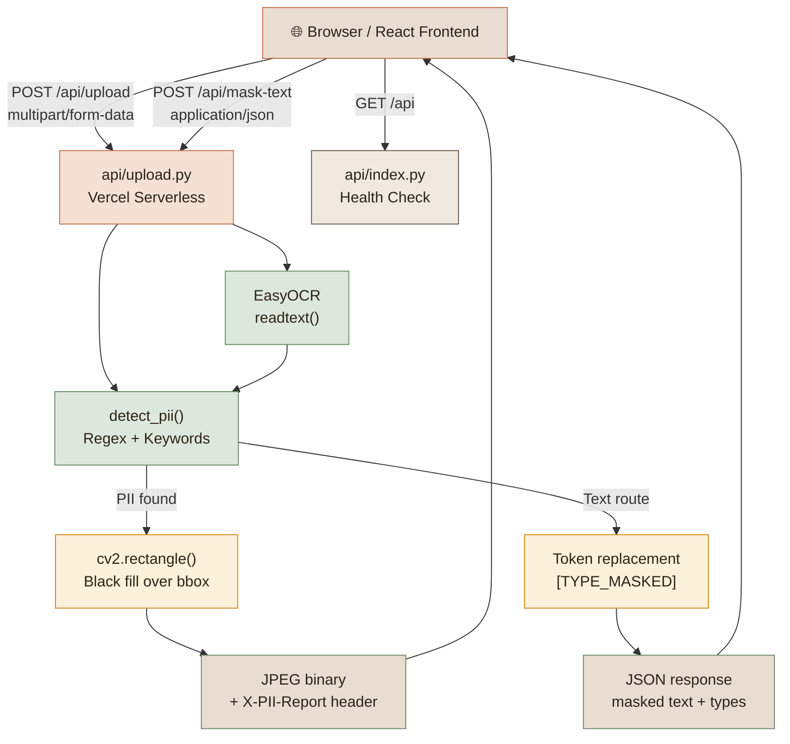
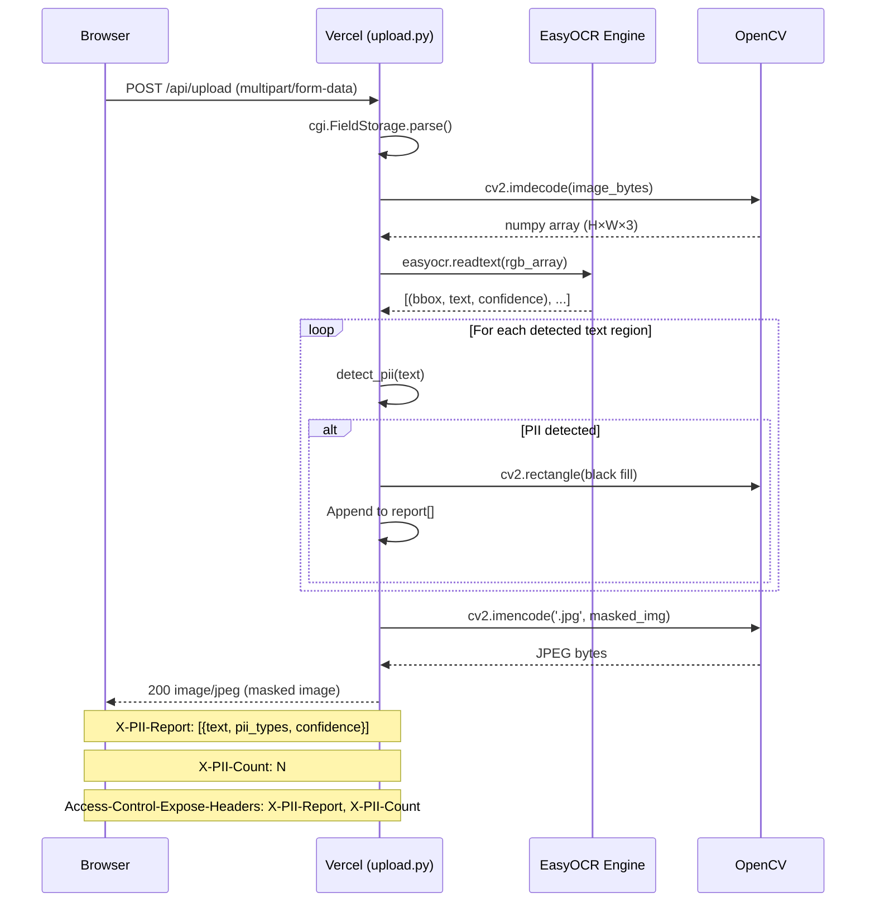
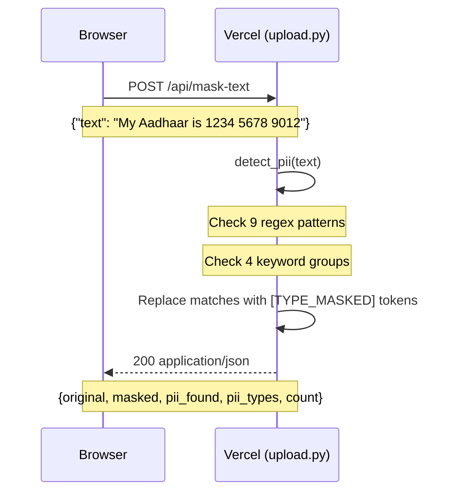
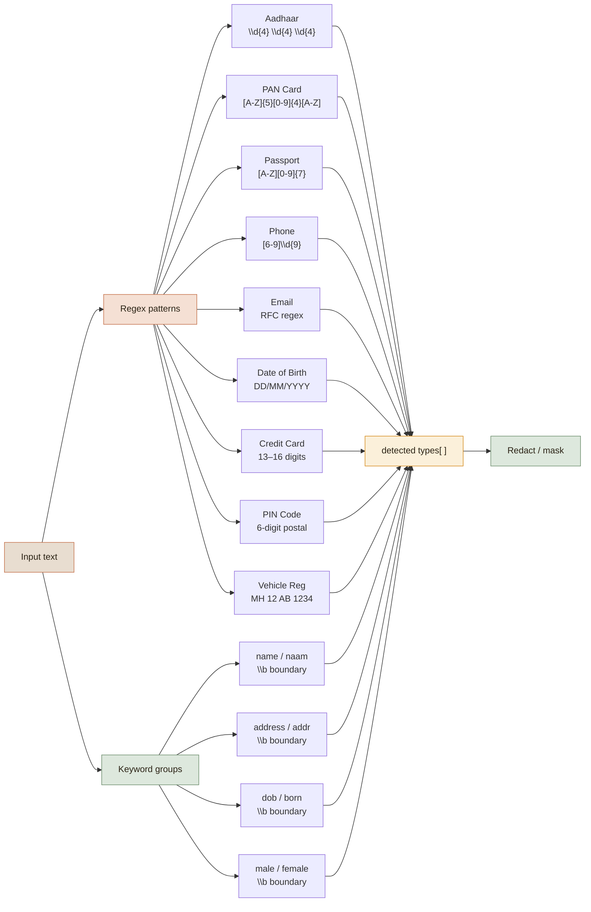

# PII Masking App

Automatically detect and redact **Personally Identifiable Information** from document images and free-form text using OCR and pattern matching — no external AI APIs required.

---

## What it does

| Mode | Input | Output |
|---|---|---|
| **Image** | JPEG / PNG / WebP / BMP document photo | Masked image with PII regions blacked out + detection report |
| **Text** | Any free-form text | Redacted text with `[TYPE_MASKED]` tokens replacing PII |

### Detected PII types

| Type | Pattern / Method | Example |
|---|---|---|
| Aadhaar Number | `\d{4} \d{4} \d{4}` | `1234 5678 9012` |
| PAN Card | `[A-Z]{5}[0-9]{4}[A-Z]` | `ABCDE1234F` |
| Passport | `[A-Z][0-9]{7}` | `A1234567` |
| Indian Phone | Anchored `[6-9]\d{9}` | `9876543210` |
| Email Address | RFC-style regex | `user@example.com` |
| Date of Birth | `DD/MM/YYYY` variants | `01/01/1990` |
| Credit/Debit Card | 13–16 digit sequences | `4111 1111 1111 1111` |
| PIN Code | 6-digit Indian postal | `400001` |
| Vehicle Registration | `MH 12 AB 1234` | `MH 12 AB 1234` |
| Name / Address / DOB / Gender | Keyword whole-word match | `Name:`, `DOB:`, `Address:` |

---

## Architecture



### Request flow — image masking



### Request flow — text masking



### PII detection engine



---

## File structure

```
pii-masking-app/
│
├── api/                            Vercel serverless functions
│   ├── index.py                    GET /api — health check + endpoint list
│   ├── upload.py                   POST /api/upload + POST /api/mask-text
│   ├── requirements.txt            Python deps for Vercel (headless, minimal)
│   └── processed/
│       └── [filename].py           GET /api/processed/:file — serve masked images
│
├── backend/                        Local development FastAPI server
│   ├── run.py                      Entry point: uvicorn app.main:app
│   ├── requirements.txt            Full deps including uvicorn
│   ├── test_pii_detection.py       Unit tests for PII detection patterns
│   └── app/
│       └── main.py                 FastAPI app — mirrors api/upload.py logic
│
├── frontend/                       React 18 SPA
│   ├── package.json                Dependencies: react, react-dom, react-scripts
│   ├── .env.production             REACT_APP_API_URL= (empty — same-origin /api/*)
│   ├── .env.local.example          Template: point to localhost:8000 for local dev
│   ├── public/
│   │   └── index.html              HTML shell
│   └── src/
│       ├── index.js                ReactDOM.createRoot entry
│       ├── index.css               Minimal reset
│       ├── App.js                  Two-tab UI: image upload + text masking
│       └── App.css                 Design system (warm earthy palette)
│
├── vercel.json                     Routing: static build + serverless functions
├── test_vercel_deployment.py       Integration tests (health, mask-text, upload)
├── README.md                       This file
└── DEPLOYMENT.md                   Vercel deployment walkthrough
```

---

## Quick start

### Option A — Local backend (FastAPI)

```bash
# 1. Clone
git clone https://github.com/BugHunterX2101/pii-masking-app.git
cd pii-masking-app

# 2. Backend
cd backend
pip install -r requirements.txt
python run.py
# API at http://localhost:8000

# 3. Frontend (new terminal)
cd ../frontend
cp .env.local.example .env.local
# .env.local already has REACT_APP_API_URL=http://localhost:8000
npm install
npm start
# App at http://localhost:3000
```

### Option B — Vercel dev (serverless locally)

```bash
npm install -g vercel
vercel dev
# Frontend + serverless functions at http://localhost:3000
```

### Option C — Deploy to Vercel

```bash
vercel --prod
```

---

## API reference

### `POST /api/upload`

Upload an image; returns the masked image as JPEG binary.

**Request:** `multipart/form-data`, field name `file`

**Response:**
- Body: JPEG image bytes (masked)
- `Content-Type: image/jpeg`
- `X-PII-Report: [{"text": "...", "pii_types": [...], "confidence": 0.95}, ...]`
- `X-PII-Count: N`
- `Access-Control-Expose-Headers: X-PII-Report, X-PII-Count`

| Code | Reason |
|---|---|
| 400 | No file field / empty file / not an image |
| 500 | OCR or image processing error |

---

### `POST /api/mask-text`

**Request body:**
```json
{ "text": "My Aadhaar is 1234 5678 9012 and email is me@example.com" }
```

**Response:**
```json
{
  "original":  "My Aadhaar is 1234 5678 9012 and email is me@example.com",
  "masked":    "My Aadhaar is [AADHAAR_MASKED] and email is [EMAIL_MASKED]",
  "pii_found": true,
  "pii_types": ["aadhaar", "email"],
  "count":     2
}
```

---

### `GET /api`

Health check — returns version and available endpoints.

---

## Running tests

```bash
# Unit tests (PII pattern logic, no OCR required)
cd backend
python test_pii_detection.py

# Integration tests (requires running server)
python test_vercel_deployment.py --base-url http://localhost:8000
```

---

## Technology stack

| Layer | Technology | Purpose |
|---|---|---|
| Frontend | React 18 | SPA with drag-and-drop, two-tab interface |
| Fonts | Playfair Display, Source Sans 3 | Warm serif + clean body pairing |
| API (serverless) | Python `BaseHTTPRequestHandler` | Vercel-compatible handlers |
| API (local dev) | FastAPI + Uvicorn | Full-featured local server |
| OCR | EasyOCR 1.7.2 | Text extraction from images |
| Image processing | OpenCV headless 4.8 | Decode, rectangle masking, re-encode |
| Pattern matching | Python `re` | Compiled regex for all PII types |
| Deployment | Vercel | Static CDN + Python serverless functions |

---

## Known limitations

- **Ephemeral `/tmp`** — Vercel invocations don't share `/tmp`. The `/api/processed` endpoint works locally; in production the masked image is returned directly in the upload response body.
- **OCR accuracy** — EasyOCR performs well on printed text but may miss handwritten or heavily stylised fonts.
- **Cold starts** — First request after idle may take 10–30 s while EasyOCR loads model weights (~50 MB).
- **File size** — Images over ~5 MB may hit Vercel's 10 MB request body limit. Compress before uploading.
